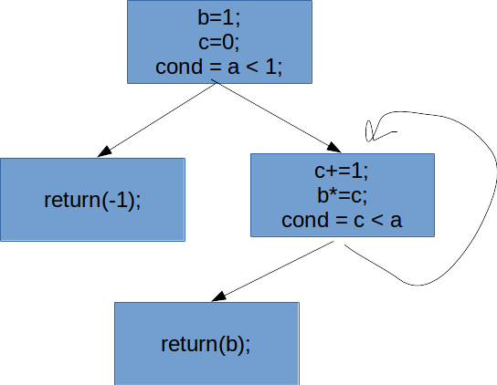
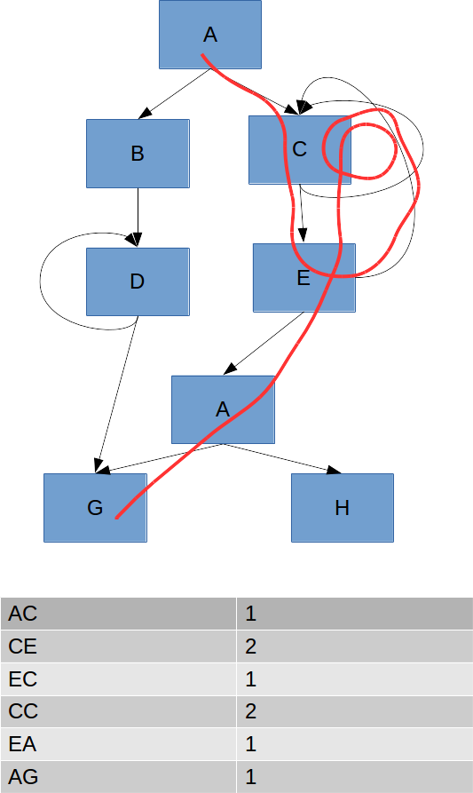
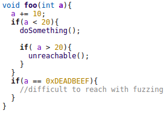
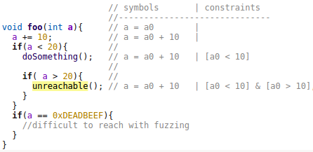
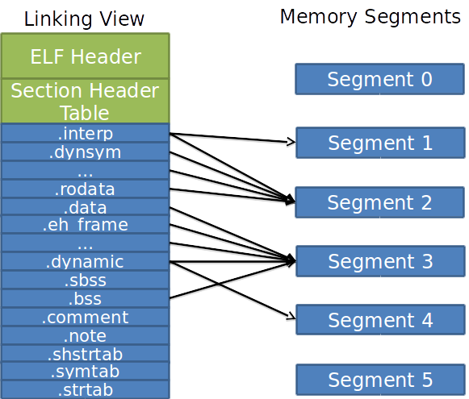
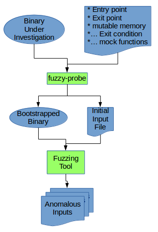
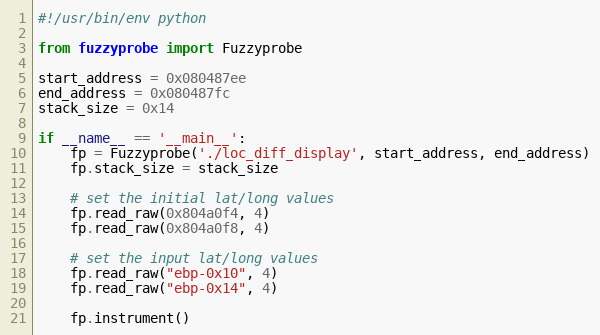

---
title: Instrumented Fuzzing of Binary Sections

author: Thomas Fordon

date: \today{}

geometry: "left=1.5in,right=1in,top=1in,bottom=1in"
header-includes:
    - \usepackage{setspace}
    - \doublespacing

abstract: |
  This paper presents a tool for fuzzing a portion of the logic in a binary file.
  This is important because it will allow a user to quickly test portions of a binary when it is difficult to emulate the entire system.
  This has practical applications for embedded systems testing and reverse engineering in general.

  Embedded systems will be easier to fuzz since the control logic without having to emulate the I/O of the system.
  Additionally, the state of the system can be tested without needing a long running process.
 
  This tool will allow a reverse engineer (RE) to break their work into smaller pieces. 
  As they are performing their work, they can create testable descriptions of the expected behavior for sections of code.
  By fuzzing these descriptions, an analyst can test both their code as well as their mental model.
  \pagebreak

---
\pagebreak

# Introduction #

This project began with the goal of enabling fuzz testing for embedded systems.
I wanted to be able to find malware triggers that could exist in a binary when the source code is not available.
The traditional approach of stimulating real hardware and hoping for a crash seems insufficient.
I realized what I really want to fuzz is both the state of the process as well as the inputs.
This work is a continuation of work done in a previous class [@fordon2016]

I want to do something very similar to in-memory fuzzing.
I would like to be able to describe the expected behavior of the system as well as the expected process state.
Additionally, I want to only test the control logic of the binary under test.
These systems can be difficult to emulate since the binary will interact with other components via memory mapped I/O.
Being able to test only a small section of the program would be especially useful for embedded systems.

This paper explores the use of binary patching to fuzz test for vulnerabilities in programs.
I fuzz a portion of a program by simulating the possible states of a running process when it encounters the specified portion.
I do this by identifying a portion of the program to test and describe the preconditions and post-
conditions that are expected for this portion of code.
I then instrument a new binary that tests the possible process states that meet the preconditions.
Each test confirms that the post-conditions are met and that the program does not crash or hang.

By properly describing the pre-conditions and post-conditions for a given portion of the code it is possible to create all valid process states.
It is then possible to instrument a binary to enable the testing of these process states and the expected behavior as described by post-conditions.

The instrumented binary will make it easier to leverage existing fuzzing tools.
The new binary will set the memory to a valid pre-condition state based on stdin.
Different stdin values will lead to different, but valid, pre-condition process states.
After running to the end of the designated section, post-conditions are validated.

By using stdin to set the process-state we can leverage existing fuzzing tools.
The new instrumented binary will behave like a normal program that reads from stdin.
The process is expected to terminate quickly and without error.

Using this technique we can isolate the relevant section of a program and specific, security-related conditions.
This approach has several advantages:

* It is easier to test difficult to emulate systems since you can avoid complex sections (e.g. database calls and system I/O).
* When reverse engineering you can write your security related assumptions and test them
* Smaller tests are generally faster.

This method requires some reverse engineering of the binary to find a section that may contain vulnerabilities.
The user must determine what the possible initial and final states are.
This cannot be used by a non-expert user.
However, this paper will argue that the reverse engineering is required to perform a meaningful discovery of vulnerabilities.
Locating bugs requires the user to first define the expected behavior of a system.
When the system behaves out of spec there is the potential for a vulnerability.
Without knowing the spec discovering vulnerabilities is not possible.

This tool is also useful because it allows a reverse engineer to test their assumptions.
As the RE is performing their analysis, they are creating mental models for how the program should behave.
This tool allows the RE to specify these assumptions and then test them.

# Background #

## Fuzz Testing ##

Fuzz testing is the process of testing with a large set of inputs, often randomized, to exercise the boundaries of expected behavior.
By throwing a large number of inputs at a program a tester hopes to thoroughly exercise a program and find bugs.

There are two main categories of fuzz testing: mutational and generational.
Generational fuzzing knows the structure of the data and is able to generate the entire input.
Mutational fuzzing does not know the format of the input and determines the input by modifying a template.
Generational is often referred to as "smart fuzzing" and Mutational as "dumb fuzzing" [@miller2007analysis]
This is because generational fuzzing needs to know the structure of what it is fuzzing.

Mutational fuzzing is less directed and not tailored to a specific program.
For these reasons mutation based fuzzing is easier to begin with, but generally less effective at locating errors<!--[@citationNeeded]-->.
This is due to the large number of completely invalid inputs.
Generational fuzzing tools know what structures are expected, and can thus fuzz closer to the boundaries of expected behavior where more errors are likedly to occur<!--[@citationNeeded]-->.
However, mutational fuzzers can find bugs that generational may not [@demott2007]

Code coverage is important when assessing the effectiveness of a fuzzing technology.
This lets us roughly assess how well the tests are able to exercise program under test.
There are two primary types of coverage: statement and branch.
Statement coverage is the percentage of executable statements that have been executed.
Branch coverage is the percentage of branch paths that have been executed

{height=50%}

Figure \ref{figCFG} is an example control flow graph (CFG) for a program.
The control flow graph represents all possible paths of execution for a binary.
Each node on the graph represents a block of code and the edges show potential jumps or branches.
Each block of code is a series of non-branching statements.

Ideally, a fuzzer could achieve 100% coverage of all statements and branches.
In reality, this is not practical.
There can be unreachable code due to programming errors.
For these reasons, it may not be possible to achieve 100% coverage and to know if 100% coverage is even possible would require complex dataflow analysis.
With this in mind, fuzzing can never guarantee full coverage, but can only hope to better discover bugs.
Nevertheless, coverage is still useful in discussing the effectiveness of fuzzing.

Another important distinction is if the fuzzer is aware of the program's structure and/or the coverage during the execution.
Depending on the fuzzer's awareness it is either: white-box, black-box, or grey-box.
If the fuzzing tool is unaware of both the program structure and coverage, it is considered a black-box fuzzer<!--[@citationNeeded]-->
White-box fuzzers are aware of the program structure and can perform analysis to determine inputs that will better exercise the program<!--[@citationNeeded]-->.
Grey-box fuzzers are not aware of the program structure, but do have knowledge of coverage<!--[@citationNeeded]-->.

Each fuzzing technique has its merits.
Black-box fuzzing is the simplest since it does not need to know details on what it is fuzzing.
This usually allows for very fast execution, but does not lead to interesting code paths since it is not aware that paths even exist<!--[@citationNeeded]-->.
Whitebox fuzzing can find new code paths through semantic execution, but this can be much slower than black-box testing<!--[@citationNeeded]-->.
Gray-box fuzzing is fairly efficient compared to black-box, but still cannot find the deep code paths that white box testing can discover.
For these reasons, there have been many projects that combine the advantages of white-box fuzzing with either black-box or gray box <!--[@citationNeeded] [@citationNeeded]-->.

### In-memory Fuzzing ###

In memory fuzzing takes a running process and fuzzes portions of the process state<!--[@citationNeeded]-->.
The fuzzing tool forks the process under test and then mutates a portion of memory.
Each permutation of process state is then executed.
This allows a user to designate sections of memory that could change, and run the same section of code through many iterations.
In-memory fuzzing takes a single execution path that is partially executed.
The fuzzer clones this process and modifies memory before finishing.

By doing this an analyst can gain a better understanding of how the process works.
They may want to know how the program would behave in similar, but slightly different, scenarios.
This is not traditional fuzzing since it does not modify a program's inputs.
It is still interesting to see how the process behavior can change when portions of its memory are modified.

In-memory fuzzing can allow a user to avoid portions of a binary that make it non-conducive to a fuzz tester[@corelan2010].
For example, the program could have a long initialization or network limitations.
By allowing the analyst low level access, they can test just the portion of the code they are interested in.

In-memory fuzzing is only really useful to somebody with a reverse engineering background.
In order to use in-memory fuzzing, the user must have an understanding of how the program is working and what variables are in use.
As a consequence, in-memory fuzzing has not gained widespread adoption<!--[@citationNeeded]-->.

### Evolutionary Fuzzing ###

Evolutionary fuzzing is a newer category of fuzzing that uses evolutionary algorithms to manage the inputs used in fuzzing.
These tools use a feedback mechanism to determine the effectiveness of individual inputs in exercising a program.
Evolutionary fuzzers use genetic algorithms to increase the code coverage and discover vulnerabilities.

An evolutionary fuzzer generally has a collection of inputs for the program under test.
The fuzzer then mutates the inputs to create new, potentially interesting, inputs.
The new inputs are then run against the program under test.
The fuzzer then examines the code coverage of that particular execution to see if that input should be added to its collection of inputs.

Evolutionary fuzzers are a fairly recent development.
In 2007, DeMott introduced EFS at DefCon[@demott2007].
This was the first published general purpose evolutionary fuzzer that did not require source code.
EFS is an evolutionary gray-box fuzzer that uses code coverage to determine fitness of inputs.

EFS was able to prove that an evolutionary mutation based fuzzer could "discover" the protocol of the input by monitoring execution paths.
It could effectively test complex inputs without prior knowledge of the inputs structure.
This was useful because it allowed better testing of programs where the source code was not available without reverse engineering.

Since EFS, there have been many other mutation based fuzzing tools <!--[@citationNeeded] [ @citationNeeded]-->.
In recent years, American Fuzzy Lop has gained particular popularity due to its practical approach and because it is open source.

#### American Fuzzy Lop ###

American Fuzzy Lop (AFL) is an evolutionary mutational fuzzing tool <!--[@citationNeeded]--> that works with programs which expect a single input file.
AFL maintains a set of inputs which it mutates and evaluates.
AFL mutates an input, invokes the program under test with the mutated input, and evaluates coverage.
AFL then uses the coverage as a fitness test to determine if the new input should be kept in the candidate pool.

AFL focuses on single input file programs and works best if the program executes quickly.
Programs and libraries often need to be bootstrapped in order to expose their functionality to AFL.
To bootstrap a library, a new program is written that reads any necessary inputs and calls the function under test.
Similar bootstrapping can be performed to target the network interfaces of a program.

{height=50%}

Figure \ref{figCFGPath} shows the branches taken during a single execution of a program.
AFL would represent this coverage by counting the number of times each edge on the control flow graph was traversed.
The table in the image above also shows the expected edge counts for the example code path.

Internally, AFL uses a hashmap to store this table.
The map is kept small to improve memory caching so collisions are expected, but in practice are not a concern.
There are two ways that AFL can populate this map.
If the source code is available the binary should be instrumented at compile time.
When instrumented, new code is injected along branch points to allow for branch coverage tracking.

AFL also has a way to perform fuzzing when the source code is not available.
AFL integrates with a modified version of QEMU to add similar code to an emulated binary.
As QEMU translates the code blocks to the native system, the branch tracking code is injected.
This runs ~2x-5x slower than with an instrumented binary so it is not preferred if the source code is available.
By integrating with QEMU, AFL also allows support for fuzzing non-native binaries.

### Augmented Fuzzing with Symbolic Execution ###

There are many solutions that use symbolic execution to augment their fuzzing engines.
Microsoft introduced SAGE [@godefroid2008automated] in 2008.
SAGE was the first fuzzing tool that integrated with symbolic execution to improve coverage.

Symbolic execution and fuzzing work very well together.
Fuzzing engines have proven very effective at finding real bugs in production software,
however, fuzzing engines can have difficulties with checksums and simple static comparisons (like x==0xDEADBEEF).
Constraint solving with symbolic execution is excellent at solving these problems.
Symbolic execution by itself has suffered from practical issues due to a path explosion problem.

Constraint solving with symbolic execution works by representing the process as a formal system.
Each statement that is evaluated has specific effects on this system.
To symbolically evaluate you represent the possible states for all variables in the system.
It is easier to solve for system constraints by representing the system in this way.

As an example, consider the code in Figure \ref{figConstraint1}.

{height=50%}

A constraint solver could determine, "when calling foo, what conditions must be true to call 'doSomething()'".
This could be solved by symbolically executing and adding constraints and solving them.
Figure \ref{figConstraint2} is the same code with some extra information.

{height=50%}

The variable a is tracked as a symbol. a0 and constraints are also tracked.
It is easy to see that to call doSomething(), a0 must be less than 10.
Similarly, unreachable() is not reachable.

This example is fairly simple and does not address code path explosion.
In most programs there are a large number of potential code paths and the large number of possibilities make symbolic execution slow.
For this reason, it is often useful to perform symbolic execution on one code path from a concrete execution.
This is known as concolic (concrete-symbolic) execution.
Concolic execution takes a particular code path and attempts to perform symbolic execution and constraint solving on a recent branch.

Many tools combine symbolic execution with fuzz testing <!--[@citationNeeded] [@citationNeeded]-->.
Driller uses a stuck heuristic by letting AFL run until it stops finding new inputs.
Driller then attempts to perform constraint solving to discover new code paths.
If new code paths are discovered, they are added to the AFL inputs and the fuzzing continues again.

## ELF Injection ##

ELF (Executable and Linking Format) is a file format that describes executables, object files, and shared libraries.
ELF executables describe how a process should be loaded into memory.
ELF describes segments of memory that are intended for code and data and the permissions of these segments.
The file also describes which shared libraries should be linked into the process by the OS.

The ERESI team released a tool, called elfsh, that can inject an object file into an ELF file.
Their method of injecting a relocatable ELF object file into an executable ELF file is described in [@mayhem2003], but I will provide a brief overview.
The goal of this injection is to minimally modify the existing binary while still allowing the executable to work with standard protection mechanisms like ASLR and NX.

{height=50%}

The ELF format provides two views of the file; a linking view and and execution view as seen in \ref{figElfViews}.
The linking view is concerned with how the program is going to be built, and the execution is concerned with what the process image will be.
The linking view describes sections of data that reside in the ELF file as well as symbols that need to be resolved at link time.
The executing view describes the process as segments of memory with their permissions.
A section may not be mapped to a segment, but multiple sections can be mapped to the same segment.

{height=50%}

Figure ref\{figElfSection} is an example of sections in an ELF file and how they are mapped to segments in memory.
The ERESI injection method will insert two new sections into the ELF file; a code section and a data section.
The code section will be mapped immediately before the ".interp" section into the third data segment.
The data segment will be mapped immediately after the ".bss" section into the fourth data segment.
By performing the injection in this way, the code under test will be in the same location and the memory segments will still have the proper protections.
It is important that the original code is unmoved since ELF executables do not provide relocation data.

{height=50%}

Figure \ref{figElfInjection} shows how the file will be modified from the linking perspective as well as the changes in the memory segments.
The following changes were made to the sections:

* Four new sections are added and the section headers are adjusted to reflect the change in file offsets.
* .symtab (symbol table) is to be updated by merging the two files
* .strtab (string table) is to be updated by merging the two files
* .shdrstab (section header string table) is updated since new section names were added

It is important to note that the segments, for the most part, did not change locations.
Segments 2 and 3 were extended, but the section mappings did not change.
Each of the original sections is still mapped to the same location in the segment, but segments two and three were extended to accommodate the new sections.

It is important to note that the injected code can call functions defined in the original executable.
Conversely, it cannot call any new functions.
To declare new functions would require changes in many other sections and ultimately require that the original code be relocated.
To relocate the original code is a non-trivial task that is not done in the ERESI injection method.

# My Approach #

## Motivation ##

The initial motivation for this tool was to enable the fuzzing of embedded systems.
When fuzzing these systems, testers will often use real hardware and send random data to the inputs and hope for a crash or anomalous behavior.
This method can only find a small category of errors.
Specifically, this can only find inputs that cause extreme behavior (like a crash, or obviously incorrect outputs).
Additionally, real hardware can be expensive and this manner of testing does not scale well.

I wanted to be able to fuzz these systems in an emulated environment.
There is a great deal of work on fuzzing embedded systems <!--[@citationNeeded] [@citationNeeded]-->.
The popular approach is to emulate the system and then fuzz the inputs with different inputs.
This is essentially the same approach as outlined above except with an emulated system instead of a real system.
Emulating the system reduces the hardware costs and allows scaling.
Emulation alone does not fundamentally increase the ability to find difficult errors.

Fuzzing without knowledge of internal process state is unlikely to find many code paths in a complex program.
Black-box testing is very unlikely to discover a complex sequential input that arrives at a bad program state.

Avionics systems, like many embedded systems, often cycle through the steps of input, compute, and output.
I wanted to be able to test just the compute section under emulation.
By testing only the compute section, my hope is to avoid needing to emulate the more difficult input/output sections.
This problem reminded me of in-memory fuzzing.

I would like to be able to do something like in-memory fuzzing.
I want to simulate a running system and fuzz the process state.
By doing this, I should be able to focus on just the important sections.

I would like to focus on just exposing the system to fuzzing and not the actual fuzzing.
By doing this, I can support fuzzing with many different fuzzers.
This approach should work with all types of fuzzers discussed above (generational, mutational, black-box, white-box, grey-box, evolutionary).

## Approach ##

To find vulnerabilities, you need to first define what the expected behavior is.
Without this, you are looking for only the grossest of errors.
Before continuing, some definitions are in order:

* A bug is when a program does not behave to specification.
* A vulnerability is a bug that can be exploited to achieve a security related goal <!--[@citationNeeded]-->

The specification is how the program should behave.
Preferably, this is defined by a formal specification or a contract.
If a program dos not have a formal specification, an informal "expected behavior" becomes the specification.
Users of a program usually expect the following (in addition to application specific behavior):

* The program will not crash.
* It will not hang.
* It will do specific things and nothing else
* It will not consume "too many" resources"

If the program breaks this expected behavior then there is a bug.
Whether this bug has a security implication depends on the system.
If the user is not concerned with denial of service attacks, perhaps the "too many" resources is not a vulnerability.
The definition of a vulnerability requires an understanding of the user's security needs.  
With this in mind, the first step of vulnerability discovery should be to define the expected behavior and the security constraints.
By doing this, the RE has a better understanding of what they are looking for.
You can't find a "bug" if you can't define it.

In reality, this is an iterative process.
As the RE explores a program, they develop a model of how portions of the program should behave<!--[@citationNeeded]-->.
They discover what assumptions the developer made.
By viewing the program from an aggressive standpoint they also have models of where these assumptions may be incorrect.
As an example, the original programmer may have assumed a character-array input would be no more that 100 characters.
As the RE tests their mental models, they refine them and determine new constraints as well as new potential ways of breaking these constraints. 

This paper uses the concept of a formal constraints to define the pre/post conditions for a section.
Although constraints are used, we will not make an effort to prove correctness.
Proving correctness through constraint solving is an interesting area, but this paper focuses on fuzzing these assumptions.

It is important to note that the pre-conditions and post-conditions that are being tested are probably NOT what the designer assumed.
These pre/post conditions are determined from the point of an aggressive actor.
The pre-conditions should describe the possible states an adversary could get the program into.
The post-conditions describe all "non-vulnerable" states.
The RE determines these through normal reverse engineering processes.

{height=25%}

Figure \ref{figInputsVen} illustrates allowed versus expected behavior.
Many security errors occur near the boundaries of expected behavior.
The programmer may not have properly tested, or made faulty assumptions about the potential inputs.
Perhaps the program will operate to specification as long as the inputs are "valid", but the calling code can provide inputs that are not to specification.
Usually, developers are not writing to a formal specification and the programmer/caller each have an idea of the expected behavior.
Without a formal specification the programmer vs caller assumptions are likely to vary and create space for bugs/vulnerabilities.

This project began as an attempt to enable easier fuzzing of embedded avionics systems.
The focus has shifted to fuzzing of specifications for portions of binaries.
This is the natural way to approach the original problem and has broader implications.
This work is also more easily compared to existing computer science work.

This paper explores ELF32 formated binaries, but the general concepts will apply to other formats.
For this tool I chose to use ELF32 due to its popularity and the availability of tools.
I no longer think this was the correct choice.
Injecting code into an ELF32 binary proved to be more difficult than expected.
Creating an instrumented binary based on a raw binary (as is typical in most embedded systems) would have been more effective.

{height=50%}

At a high level, I am going to take the binary under investigation and create a new binary that can be fuzzed \ref{figProcessOverview}.
In order to do this, I need to supply information to the instrumentation.
In addition to the instrumented binary, a default input file is also created in order to ease integration with American Fuzzy Lop.

## An Example ##

It will be instructive to walk through a quick demonstration.
Figure \ref{figExample1Code} is the source code for a program that I will target.
At startup it asks for a starting location and initializes static memory.
Then it continuously reads a new lat/long/elevation location and displays (delta latitude / delta longitude), where the deltas are based on the original location.
This software has a hidden feature.
If the initial location is 42.0,42.0 and the current location is near WSU, the process crashes.
This represents a malware trigger that we would hope to detect.

First, I will compile the program in order to create a target we can perform RE on.
I'll leave symbols in to make the output from radare2 easier to read.
The following is a view from radare2, a popular reverse engineering tool.

{height=75%}

By reverse engineering the binary (See Figure. \ref{figExample1Rad}), I can determine several things:

* The locations for the initial latitude and longitude are 0x804a0f4 and 0x804a0f8 respectively.
* The locations for the input latitude and longitude are (ebp-0x10) and (ebp-0x14) respectively.
* The start/end locations of the section to test, as commented in the original source code, are 0x080487ee and 0x080487fc

{height=50%}

With this reverse engineering knowledge I can use my project's tool (fuzzyprobe) to create a new binary.
Figure \ref{figExample1Instrumenntation} shows a script that invokes the instrumentation tool.
The instrumented binary does the following:

1. Reads 4 bytes and stores them to the initial latitude.
1. Reads 4 bytes and stores them to the initial longitude.
1. Reads 4 bytes and stores them to the input latitude.
1. Reads 4 bytes and stores them to the input longitude.
1. Jumps to the section under test.
1. Terminates at the end of the section.

This new program can now be called and supplied a 16 byte input.
The process state immediately before executing the section under test is controlled by the input file.
Now by supplying different input files we can test different states of the process.
Since the input is read in binary form, I wrote a small tool to convert strings to floats.
Since I know the program, I invoked it with some interesting values to exercise the code and trigger the fault (See Figure. \ref{figExample1Manual})

{height=50%}

As demonstrated, I now have a program that can call a section of the original program.
Additionally, this instrumented binary can use stdin to specify portions of the program state.
The real goal of this paper is to expose the program to fuzz testing.
I used American Fuzzy Lop to test the instrumented program.

{height=50%}

Figure \ref{figExample1AFL} shows the output of fuzzing the instrumented binary with AFL for 13 minutes.
AFL was able to find the branch that would occur if the second lat/lon pair was "near" WSU,
however, it was not able to find the crash that occurs with the additional constraint that the first lat/lon pair is exactly 42.0/42.0.
This is not completely unexpected.
Even if the "near WSU" numbers were fixed, it is extremely unlikely that AFL will stumble on the exact lat/lon values.
Each attempt would have a 1 / 2^64 chance of finding the input I am interested in.  At 325 samples/second this will take an average of 900 million years to discover.

Even an evolutionary fuzzer like AFL cannot be expected to find these types of crashes.
A constraint solver should be able to quickly find the input,
but I was not able to get a hybrid fuzzer / constraint solver to work with my instrumented binary due to time constraints.
I am confident that such a tool would work.

## Programmatic Steps ##

This section gives details on how the instrumentation works.
At a high level, the instrumentation does the following steps:

1. Creates a c source file.
2. Compiles the c file into an object
3. Injects the object into the initial binary
4. Redirects the main entry point to a new "main" function
5. Adds a jump instruction at the end of the section under test to do an "end check"

The source file in the first step is responsible for reading the input, setting the initial state, calling the section under test, and finally checking the results.
Steps 2-4 are the same for every instrumentation.
Step 5 merely adds a jump instruction.

Steps 2-5 will be discussed in more detail in later sections.
In the next section, I will discuss step 1.
Specifically, how the defined constraints lead to generated source code.

## Defining Constraints ##

The goal of this paper is to fuzz a set of system states for a process.
This is done by defining subsections of the original process and describing valid system states.
This project focused on memory, but other system states could also be exposed.
This could include the ability to set registers or defining more complicated behavior for a memory mapped region.

There are three areas of memory that we are concerned with: statically allocated, stack based, and heap based.
For each of these types of memory I need to be able to assign fixed values or mark the area as mutable.
If an area of memory is not explicitly defined, it is fixed and generally has a value of zero.

### Statically Allocated Memory ###

Statically allocated memory has a set location and size within a process's memory space.
This memory is the simplest to instrument, but the address must be known at compile time.
A user needs to locate this memory as well as the bounds of the section under test.
After this it is straightforward to set fixed values and define mutable areas.

{height=50%}

In Figure \ref{figExample2Instrumentation}, I load a binary, set some fixed values, and denote that other values are mutable.
Finally, I tell the tool to create an instrumented binary.
When the instrumented program runs, it will set any fixed values that were specified and then populate the mutable areas with values from stdin.

{height=50%}

Figure \ref{example2GeneratedCode} shows the generated C code that will be injected into the target binary.
The new\_main function will become main, and the end\_check function will be run after the section under test.
The actual code is very straightforward.
The instrumented code will read a fixed number of bytes from stdin and write them to a specific address in memory.
Then the generated code will jump to the section under test.

### Stack and Heap Memory ###

Referencing stack memory is similar to statically allocated memory.
Instead of static addresses, the variables are referenced relative to either the stack pointer, or the frame pointer.
To facilitate this, the instrumentation tool creates a new stack frame of the given size.
Then the variables esp and ebp are made available to the generated code.
Only the current frame should be modified by the fuzzer.

Heap-based memory is also available to this tool.
This space relies on a call to malloc that designates memory in the heap area of the process as used.
Doing this in my tool will create a new variable in the generated source and return the variable name.
At runtime, this variable will refer to the allocated memory on the heap.
This variable can be referenced to write fixed values as well as denote mutable memory

<!-- TODO: add a code listing with stack and heap memory -->

## Instrumenting the Binary ##

Once the instrumentation code is generated, it needs to be injected into the original binary.
The goal is to modify the original binary as little as possible.
Minimal modifications are desirable in order to test something as close to the original binary as possible.
I use elfsh in order to perform this injection.
Elfsh describes this injection as ET\_REL injection since it is injecting an ET\_REL ELF file into an ET\_EXEC binary.

The injection is performed by adding another section to the ELF file.
The main function is then redirected to the new main function that was described in the previous section \ref{figInstrumentedSegments}.
This main function is responsible for jumping to the section that is under test.
Another function is also added to check post conditions.

{height=50%}

In addition to creating an instrumented binary, a default input file is also created \ref{figProcessOverview.png}.
This input file is a seed input which tools like AFL can use to begin fuzzing.
The file is filled with zeros and is exactly as long as the expected input.

The instrumented binary has been modified using the ERESI method described previously.
New sections were added to the beginning of the executable segment and to the end of the data segment.
The Procedure Linkage Table (PLT) was modified to redirect main to the injected main.

There is a problem with injecting into binaries that do not have the glibc symbols "malloc" and "read".
This is due to the inability to call outside functions from the injected code.
Unfortunately, this is not easily resolved.
Calling outside functions requires that the code from the original binary be relocated in memory, a non-trivial task.

After injecting the pre and post code, a long jump instruction is added to the location set as the end of the section.
Some care should be taken here since the code is actually overwritten.
The reverse engineer will have to ensure that this does not overwrite anything important.

# Similar Tools #

## Binary patching tools ##

There are many fuzzing tools available.
American Fuzzy Lop and Peach are two popular examples of widely used fuzzing tools.
The goal of this project is not to compete with these tools, but to build a tool that will work with them.
Really this tool is targeted at patching binaries in order to make them --------INCOMPLETE SENTENCE---------

I did not find any similar tools in my search.
There are many tools for binary patching, but I did not find one with the specific goal of enabling fuzzing.
It is possible to use these tools in order to perform the same patches and enable fuzzing sections of code.
Phrack #66 [@pancake2009] has an excellent article on "manual binary mangling with radare".

## Interface ##

This project's API was influenced by the Manticore constraint solver from BitTrail [@manticore].
Manticore performs constraint solving by defining hooks to entry/exit points and defining system constraints.
The CPU is emulated using unicorn and the system is symbolically executed.
When an exit hook is encountered in execution, Manticore attempts to solve the constraints on the symbols.

My project has a similar interface due to the similarities in fuction.
The constraints can be viewed as pre-conditions and post-conditions and Manticore sets these constraints on process memory (as well as registers).
Manticore is solving a different problem; they are finding a specific set of inputs that solves a given set of constraints.
My project aims to find inputs that violate the constraints through fuzzing.

## In memory Fuzzing ##

In memory fuzzing takes a running process and performs mutations on the processes memory.
The process is repeatedly forked before being manipulated.
In-memory fuzzing has similar advantages to the section fuzzing of this project.
In-memory fuzzing allows you to bypass areas that would make fuzzing difficult like network connection limititations [@corelan2010].

In-memory fuzzing also requires an understanding of the underlying code obtained through reverse engineeering.
Corelan produced a set of tools "Tracer.py" and "InMemoryFuzzer.py" to ease the amount of reverse engineering required.
The tool is very usable, but uses its own mutation engine and it did not seem like it could be easily extended for emulation.
Additionally, you need to attach to a running process and add breakpoint hooks.
This limitation requires a running process and does not allow me to work with sections that are difficult to emulate.

Salawan produced a similar tool called PIN [@salwan2013] that also requires a running process with breakpoints.
Additionally, Acri presented a tool that connects to the GNU debugger (GDB) and uses this to attach to a process.
This approach seemed useful, since GDB could be invoked with QEMU, but the tool would have to be extended.

None of these in-memory fuzzing tools had the specific set of features I needed in order to target an embedded binary.
I need to be able to fuzz a non-native binary.
The Acri tool that used GDB has the potential to work with QEMU, but it would need to be modified.
Additionally, these tools use their own input mutation engines and do not support evolutionary fuzzing or constraint solving for path discovery.
These features are highly desired to ensure code coverage and discover vulnerabilities.

# Conclusion #

I have presented a tool that is useful for fuzz testing sections of an ELF executable.
A user can define the section as well as the pre/post conditions and create a new binary that can be more easily fuzzed.
The tool I presented does not perform the actual testing, but enables the use of fuzzers like American Fuzzy Lop and Peach.

The fuzzing of sections of a binary allows analysts to search for potential vulnerabilities.
Additionally, it allows reverse engineers to test their assumptions as they are doing their work.
This tool resembles an in-memory fuzzer in that it allows the user to fuzz the process state and not just the inputs.
By fuzzing process state, an analyst can test their assumptions on the expected pre/post conditions for sections of code.
The presented tool is a helpful addition to the field of cybersecurity.

# Future Work #

I did not finish all the work that I envisioned for this project.
The current state is a good proof of concept, but it will require additional work before it is a useful tool.
I am going to be developing this tool in order to perform fuzzing on an embedded system.
I will be adding new features to the tool on an as-needed basis, and I anticipate that many changes will be needed.

## Fixing symbol loading issues ##

The injection method used will not work if the original binary does not use "read" and "malloc" from glibc.
There are several ways to deal with this.
I could hijack an existing, unused function/library, or look into incorporating a relocation engine into libelfsh??????????????????.

I think there is an easier solution: I would like to focus on bare-metal binaries.
The original purpose of this project was to enable the fuzzing of sections of an embedded systems binary.
These binaries do not typically come in the form of an ELF file since they are not loaded by another OS.
They are loaded to a particular address in memory and then begin execution at an entry point.
With this in mind, it is possible to construct an ELF file that loads the file into memory, and also has the symbols and libraries to support the setup/shutdown code.

## End Conditions ##

I have always envisioned the concept of end-conditions, but have not implemented them.
In the end\_check method, new assertions will be added based on the instrumentation script.
I need to be able to access static, stack, and heap memory.
This should be straightforward and easy.

## Generative memory structures ##

I would like to be able to describe the expected memory structures in the pre-conditions.
I think being able to populate Remote Procedure Call (RPC) style objects would be helpful for non-trivial binaries.
The pre-conditions would need to be extended to have a RPC style serializer.

## Shorter jump to post condition check ##

During testing, I ran into some issues injecting the jump to the post condition check.
The long jump instruction was so long that it extended into another piece of code I would like to test.
A better approach would be to push the post-condition checks address to the stack before calling the section under test.
Then I could use a shorter "return" instruction instead of a long jump.

## Simulate other threads ##

For this project, everything is single threaded.
I think it would be helpful to identify areas of memory that could change part way through the execution.
The timing of the change should be part of the input file that is fuzzed.
This would allow testing of invariant condition violations.
The developer may have assumed a condition would not change, but an aggressor could affect it.

This should be achievable by making the code self-modifying.
The instrumented binary would only execute one instruction of the section under test before returning to a control loop.
The actual section under test could be modified before each instruction call to orchestrate this.
The major drawback of this approach is that it would execute much more slowly. 

## Function Mocking ##

A major assumption of this project is that the control logic should be easy to separate from the input/output when reverse engineering.
Additionally, I observed that the I/O is often difficult to emulate for an embedded system, so it would be helpful to avoid including these sections in tests.
If there is clear separation of I/O, I can test the control logic with this tool.

Sometimes the separation is not clear and I/O code is interspersed with the control logic.
When this occurs, I would like to be able to short-circuit the I/O and instead call a mock function.
The mock function should be programmable and allow the analyst the ability to fake the expected behavior of the I/O.

# Acknowledgements #

<i>Thank you Katy for your unending patience and support.</i>

<i>Thank you Dr. Mateti for your thoughtful advice and encouragement.</i>

# References

---
nocite: |
  @*
---
